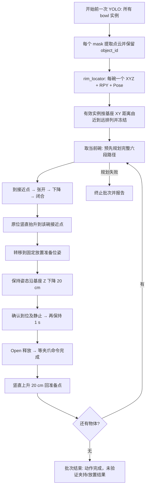

> **2026-09-23 更新：** 本文为历史方案。桌面模型与额外夹爪保护盒已按用户要求移除；当前实现见 `docs/collision_model_removal_20260923.md`，启动见 `New_run/README.md`。

# 多实例碗抓取、放置与释放实施方案

编写日期：2026-09-22。工作区：`/home/rob/robot_grasp_ws`。

**文档状态：基于当前源码、只读 ROS 实测和已有讨论的待实施设计。本次只新增本文件，不修改项目代码，不发送机械臂或夹爪控制命令。** 下文的“新增”“修改”“验收”均指后续实施工作，不代表已经完成。

## 1. 结论与项目目标

方案可以在现有三个 Python ROS 2 包上实现，无需更换 YOLO 模型、MoveIt 后端或 UR 控制器，也无需引入新的大型抓取框架。但**仅修改 `rim_locator` 无法完成整个任务**：YOLO 目前只输出一个实例，执行器目前只接收一个 XYZ 点并覆盖成固定姿态，放置动作也不存在。推荐把几何与 symbolic model 的主要修改放在 `rim_locator`，另外两包只扩展必要的数据接口与执行流程。

本版本明确采用以下范围：

1. 开始前对一组同步 RGB/点云进行一次 YOLO 实例分割，只处理 `bowl` 类别；锁定本批次物体，随后不重新感知。
2. 每个有效碗只生成**一个**抓取位姿。输出 XYZ、RPY 和对应 Pose；RPY 是 Pose 四元数的人类可读表示，不是第二套独立控制目标。
3. 抓取顺序按 `base_link` 下抓取点到基座原点的水平距离 `sqrt(x²+y²)` 从近到远排列。不按置信度或抓取评分排序，不生成 3～5 个候选。
4. 每个碗执行：接近 → 张开 → 下降 → 闭合 → 就地抬升 → 转移到固定放置准备位姿 → 沿基座 Z 方向下降 0.20 m → 到位后静止 1.0 s → 张开释放 → 向上退回放置准备位姿 → 下一碗。
5. 固定放置准备位姿取本次用户指定的“当前机械臂姿态”；将它转换为项目使用的 `base_link/grasp_center` 位姿后冻结在配置中。不要每次启动时默默重新采集一个任意当前位置。
6. 不实现抓取成功反馈、接触检测、失败恢复、自动重试或换候选。保留现有到位、静止、超时、Action 结果和停止检查；这些是执行动作的基本条件。
7. 任一步明确失败时终止本批次，记录失败物体和步骤，不自动放开可能持有的碗，也不自动继续下一碗。这样定义终止行为不等于增加恢复流程。

“抬升结束准备放置点”分为两个必要阶段：现有抬升终点是每个碗上方的接近点；本次测得的固定位置则是所有碗共用的放置准备点。两者一般不同，必须增加转移动作，不能把抓取后的竖直抬升直接改成跨桌横移。

## 2. 当前机械臂状态与放置参考点

### 2.1 实测关节角度

只读采样时间：**2026-09-22 16:59:54.994 +08:00**。关节与控制器 TCP 消息时间约为 ROS `1790067594.9942849`。下面按 UR 六关节常用顺序排列，保留原始角度分支，不将超过 ±180° 的角度强行归一化。

| 关节 | rad | ° |
|---|---:|---:|
| shoulder_pan_joint | 4.116818428 | 235.876321 |
| shoulder_lift_joint | -1.745843073 | -100.029440 |
| elbow_joint | -1.538870335 | -88.170775 |
| wrist_1_joint | -1.440079049 | -82.510452 |
| wrist_2_joint | 1.579342723 | 90.489672 |
| wrist_3_joint | -3.740896050 | -214.337555 |

来源：`/joint_states`，`sensor_msgs/msg/JointState`。关节角用于记录参考姿态和核对 IK 分支；本方案的固定目标以笛卡尔位姿为准，不要求返回完全相同的关节解。

### 2.2 控制器 TCP 与项目夹持中心必须区分

RPY 采用固定轴 XYZ，旋转矩阵约定 `R = Rz(yaw) Ry(pitch) Rx(roll)`；位置单位 m，控制与配置角度单位 rad。

| 项目 | `/tcp_pose_broadcaster/pose` 实测 | TF `base_link <- grasp_center` 实测 |
|---|---|---|
| 参考坐标系 | `base` | `base_link` |
| XYZ，m | `(-0.424166034, -0.389831215, 0.424239498)` | `(0.388824983, 0.389889715, 0.258283462)` |
| 四元数 XYZW | `(-0.999969947, -0.001839867, -0.007021497, 0.002723666)` | `(-0.001843561, 0.999969986, -0.002705731, -0.007021887)` |
| RPY，rad | `(-3.136170761, -0.014053057, 0.003641743)` | `(-3.136206687, -0.014053792, -3.137943273)` |
| RPY，° | `(-179.689348, -0.805181, 0.208657)` | `(-179.691407, -0.805223, -179.790906)` |

同次 TF 查询确认：

- `base_link <- base`：平移 `(0,0,0)`，四元数约 `(0,0,1,0)`，即绕 Z 旋转 180°；不能把两者的 XY 数字直接混用。
- `base <- tool0_controller` 与控制器 TCP 消息一致，四元数相差整体符号表示同一旋转。
- `base <- tool0` 与控制器 TCP 近似一致；本次两条采样时间相差约 24 ms，位置差约 0.021 mm。这是此次静止采样的一致性证据，不替代物理 TCP 标定。
- `tool0 <- grasp_center` 固定平移为 `(0.033, 0.001089906, 0.166452628)` m，旋转为单位四元数。
- `base_link <- grasp_center` 动态 TF 时间约 `1790067594.970305`。

执行器现有 `MoveItArm.read_pose()` 读取的是 `base_link/grasp_center`。因此后续应采用上表右列作为固定放置准备位姿，保留完整精度的记录；不能直接抄左列 TCP 数字进执行器配置。

### 2.3 固定下降 20 cm 后的目标

以项目夹持中心定义目标：

```text
place_ready.position = (0.388824983, 0.389889715, 0.258283462)
place_ready.orientation_xyzw = (-0.001843561, 0.999969986, -0.002705731, -0.007021887)
place_ready.frame_id = base_link
place_ready.tool_frame = grasp_center

place.position = (0.388824983, 0.389889715, 0.058283462)
place.orientation = place_ready.orientation
place_drop_distance = 0.20 m
place_dwell_time = 1.0 s
```

同一机械臂下降动作在控制器 `base` TCP 中，目标约为 `(-0.424166034, -0.389831215, 0.224239498)` m。两种表达因工具偏移和参考系不同而数值不同，不是两个可任选的物理目标。

上述点是**待规划验证的固定参考**，并非已验证可安全放置的位置。当前夹持中心下降后为 58.3 mm 高度，不能只检查控制器 TCP 的 224.2 mm 高度就断言有足够余量。

### 2.4 桌面模型与现场场景

本次只读检查发现磁盘已有 `/home/rob/.local/state/robot_grasp_ws/table_model.json`：版本 2，frame=`base_link`，盒体尺寸约 `(1.10, 0.45, 0.08)` m，保守上表面 `top_z=-0.045493361` m，平面系数 `z=0.003139065*x+0.020731741*y-0.072813401`。其 `generated_at=1790066828.0408385`，不是本次新采集的数据。

但是同期只读 `/get_planning_scene` 返回 **world_objects=[]、octomap_bytes=0**。磁盘存在模型不代表模型已加载到 MoveIt。检查时 JSON 的 `table_enabled=false`、`require_collision_world_for_execution=false`。

放置夹持中心比该保守桌面上表面高约 103.8 mm；这仍不能证明安全：碗底、手指和夹爪几何都不位于夹持中心，落点也必须位于有效承接区域。使用前核对模型是否仍适合当前桌面，加载并回读确认；不把旧文档中的“尚无桌面建模代码”当作当前事实。

## 3. 已有模块与缺少的功能

以下依据当前工作树源码，而非只依据历史 README。当前工作树存在其他未提交改动，尤其是桌面模型相关文件；后续实施前先核对 diff，不覆盖或回退这些改动。

| 模块/文件 | 当前实际能力 | 本任务缺口 |
|---|---|---|
| `src/yolo_vision/yolo_vision/segmentation.py`：`select_target()`、`Segmenter.predict()` | Ultralytics/OpenVINO 分割；同类别只选置信度最高的一张 mask；支持 ROI 还原 | 返回全部 bowl 实例；逐实例保留 mask 与 ID |
| `src/yolo_vision/yolo_vision/main.py`：`VisionNode.on_pair()` | 同步图像和有组织点云；单 mask 提取单目标云；成功后不再处理 | 一次采样输出多个实例；明确批次边界；当前 no_target 会回到 ready 重试，需要改为本版本的一次检测终止语义 |
| `src/yolo_vision/yolo_vision/pointcloud.py` | 按像素提取 XYZ，排除无效深度；发布只有 XYZ 的 PointCloud2 | 点云携带每点 object_id；防止不同实例混为同一个碗 |
| `src/rim_locator/rim_locator/main.py` | 按采集时刻查询 TF，转到 base_link，处理单云，发布单 PointStamped | 按实例分组；逐碗计算单姿态；按距离排序；发布整批 PoseArray |
| `src/rim_locator/rim_locator/rim_detection.py`：`locate_rim()` | z 的 98 分位数作为顶部；保留 `z >= z_top-15 mm`；按 XY 距离选最近约 10% 点，取中位数 | 自适应高度带、顶部离群点约束、局部壁面方向和夹持中心修正；当前只有单点，无朝向 |
| `src/grasp_executor/grasp_executor/grasp.py` | `Pose` 数据类已有四元数；`build_grasp_pose()` 给输入 XYZ 加固定 offset，再套 fixed_orientation；竖直 approach；执行抓取并抬升 | 接收上游真实 Pose；多物体队列；固定放置点、下降、等待、释放、退回；批次去重 |
| `src/grasp_executor/grasp_executor/main.py` | 订阅 PointStamped；工作线程运行一次 run_task；发布 grasp/approach 调试位姿 | PoseArray 输入、锁定批次、逐物体状态、整批最终结果、放置调试位姿 |
| `src/grasp_executor/grasp_executor/moveit_ros.py` | `prepare_plans()` 预先规划 approach/descend/lift 三段；OMPL + Cartesian；工具变换、碰撞、限速、到位、取消与停止 | 六段规划列表及预算；放置段缓存执行；批量预览起始状态衔接 |
| `src/grasp_executor/grasp_executor/interfaces.py` | arm 包装；夹爪仅 Open/Close，命令退出后等 gripper_settle_time；无夹持传感器反馈 | 扩展 prepare_plans 签名；释放复用 open_gripper，无需新增夹爪驱动 |
| `src/grasp_executor/grasp_executor/table_model.py`、`tools/build_table_model.py`、`run_table_model.sh` | 当前工作树已存在桌面估计、持久化、读取校验；MoveIt `_scene()` 已支持模型加载 | 本任务复用并核对正在进行的修改；实际场景为空，仍需完成加载与现场核验 |
| `tools/test_live_pipeline.py` | 单目标、PointStamped，硬编码预览三段；带 plan-only/execute 分支 | 整批 PoseArray、每物体六段、放置状态、总耗时与结果记录 |

需要特别修正文档与实现的差异：

- `docs/README.md` 写着“无抬升”，但 `execute_grasp()` 已经执行 `lifting_after_grasp`，应以源码为准。
- README 写目标保留观测时间，而 `RimNode.finish()` 实际将输出 stamp 改为当前 ROS 时间；输入 stamp 只用于 TF 查询。这是现状，后续不能假定两者相同。
- 当前 `grasp_offset.z=0.02`，不是工具长度。工具长度已由 `T_base_tool0 = T_base_grasp_center * inverse(T_tool0_grasp_center)` 处理，不能重复补偿。
- 当前 `GraspConfig.table_model_path` 类默认值为空，但 `__post_init__()` 对它要求非空；JSON 已设置路径。检查时存在这一默认配置不一致，后续先确认是否被正在进行的桌面工作修复，再调整依赖 `GraspConfig()` 的测试，不能直接假定默认构造可用。

## 4. 简单统一的 symbolic model 设计

### 4.1 模型定义与适用范围

本项目所谓 symbolic model 建议明确为**基于碗沿与局部碗壁几何的规则模型**，不是现有代码中已经实现的完整 6D 抓取模型，也不是训练出的抓取网络：

```text
一个 bowl 实例
  → 有效三维点云
  → 顶部窄高度带
  → 朝向机器人一侧的一小片可见碗沿
  → 一个碗沿位置 + 邻近碗壁法向
  → 经夹爪轴向/夹持偏移标定得到一个 grasp_center Pose
```

绿色竖直壁碗和粉色约 20° 斜壁碗使用相同公式，通过局部壁面方向适配，不按颜色硬编码类别。**碗壁倾角、碗口平面倾角和整碗倾倒角是三个不同量**；粉色碗壁约 20° 是用户描述，不能把顶部点云的任意拟合角直接当作碗口倾斜，也不能把 20° 直接填入机器人 pitch。

第一版限制为桌面直立、碗沿可见且有足够有效深度的碗。整体明显倾倒、互相堆叠/严重遮挡、局部无法区分内外壁时拒绝该实例，不扩大为任意姿态物体抓取。

### 4.2 每个实例只计算一次目标

1. **分割负责实例归属**：YOLO mask 在原图像像素坐标上索引有组织点云。mask 可以确定“哪些点属于该碗”，不能单独给出真实高度、倾角或壁厚；这些必须来自对应的有效深度与标定。
2. 按采集时间把实例点云转换到 `base_link`。每个实例分别检查有效点数、连通性/明显离群点，防止桌面泄漏或遮挡物抬高高度统计。
3. 定义可见点云稳健高度跨度 `H=P98(z)-P5(z)`，首轮参数取 `b=clip(0.20*H, 0.006, 0.012)` m。它是可见高度跨度，不保证是真实整碗高度；必须记录 H 和 b，并用两种碗实测调参。
4. 保留原来“最近可见侧”的思想。对顶部离群点清理后的高度带取靠近基座的局部点集；距离相同时稳定排序。`rim_candidates` 在这里仅指点云筛选中间点，不是多个抓取候选 Pose。
5. 用局部顶部的稳健统计确定一个碗沿锚点；不要直接把包含较多下方碗壁的整片中位数当作碗沿。可从局部高度上半部分的点取稳健中心作为首轮实现，再通过实测夹持高度校正。不得用另一侧碗沿的最大高度覆盖当前局部高度。
6. 在该锚点下方、同一侧的壁面支持邻域估计法向。定位高度带与估计壁面法向的邻域分别配置，不能只拿近似一条线的碗沿点拟合平面。首轮可测试 15～25 mm 邻域，并检查点数、平面残差、特征值退化；阈值由录制样本确定，不作为既定成功保证。
7. 用局部 PCA/稳健平面拟合得到壁面法向，并用碗的粗略中心到锚点的水平外向方向统一符号。可见点中位数受遮挡偏置，因此这里的中心只用于定向，不宣称是准确几何圆心；方向不确定或混合内外壁则拒绝，不发布随意翻转的姿态。
8. 将壁面法向作为期望夹爪闭合轴，碗沿切向作为另一轴，构造正交右手坐标系；再乘一次固定夹爪安装/轴向标定旋转，得到实际 `grasp_center` 姿态。轴向标定必须通过实物与现有 URDF 核对，不能凭 frame 名称假设哪个轴对应手指闭合方向。
9. 在已经确认的工具轴定义下，施加一份夹持中心偏移，形成最终 grasp Pose。新 Pose 输入模式不得再套 fixed_orientation，也不得再加一次旧 grasp_offset。旧 PointStamped 模式可独立保留原逻辑用于兼容，但不能同时触发执行。
10. 输出合法单位四元数及其 RPY。坏点云/不可靠法向输出拒绝原因；每个通过检查的实例恰好一份 Pose，无替代候选、无评分重排。

一种明确的几何构造如下（新设计，尚未实现）：`c=向外壁面单位法向`，`u=(0,0,1)`，`t=normalize(u×c)`，`a=c×t`，则 `R_geom=[c,t,a]`。这里 c 是闭合轴、t 是切向、a 是大致向上的壁面方向。最终工具旋转 `R_tool=R_geom*R_axis_calibration`。当叉积长度过小、法向不稳定或倾角超出已验收范围时拒绝。

这能连续表达竖直壁与斜壁，**但夹爪能否沿基座 Z 垂直插入该姿态仍需验证**。现有执行器所有直线段严格检查 XY 不变和 Z 区间；本版保持此限制，避免扩大为任意方向插入。若粉色碗必须沿倾斜工具轴插入才不碰壁，应明确判定其超出此版验收范围，再单独设计插入路径，不能只输出 RPY 就宣称解决接触问题。

### 4.3 与更完整的抓取模型相比的缺口

本模型有实例分割、局部接触几何和运动学规划，仍缺少壁厚/夹爪开口与闭合量建模、摩擦与夹持力、双接触约束、被抓碗碰撞体、其他碗障碍物、完整遮挡推断、接触反馈和重抓策略。现有夹爪只有 Open/Close 命令，也不能凭软件增加连续开口控制。

本版优先验证两种碗的可见近侧碗沿与夹爪几何是否适配；不能仅因法向算法通过就承诺抓取成功率。成功率由第 9 节的两种碗重复实验统计。

## 5. ROS 接口设计

### 5.1 数据链路

| Topic | 类型 | 修改后约定 |
|---|---|---|
| `/camera/color/image_raw` | `sensor_msgs/msg/Image` | 复用当前 RGB 输入 |
| `/camera/depth/points` | `sensor_msgs/msg/PointCloud2` | 复用与图像对应的有组织点云；传感器数据 QoS |
| `/yolo_vision/object_cloud` | `sensor_msgs/msg/PointCloud2` | 一条消息携带本批所有有效 bowl 点；XYZ 外新增 UINT32 `object_id` 字段；header 保留采集 frame/stamp |
| `/yolo_vision/status` | `std_msgs/msg/String`，JSON | 批次采集时间、实例数量、object_id、置信度、点数、拒绝原因 |
| `/rim_locator/grasp_poses` | `geometry_msgs/msg/PoseArray`，新增 | `header.frame_id=base_link`；每个 Pose 表示 grasp_center；按 XY 距离升序排列 |
| `/rim_locator/status` | String，JSON | 同一批次键、source_stamp、generated_stamp、按数组下标列出 object_id、XYZ、RPY(rad/deg)、距离及几何质量；质量只作诊断/过滤，不作排序 |
| `/rim_locator/rim_point` | `geometry_msgs/msg/PointStamped` | 可保留最近有效实例的原始碗沿点用于旧调试；不是新执行入口，也不是多目标列表 |
| `/rim_locator/base_cloud`、`rim_candidates`、`local_points` | PointCloud2 | 保留调试，新增实例字段以区分各碗；不解释为多个抓取候选 |
| `/grasp_executor/approach_pose`、`grasp_pose` | `geometry_msgs/msg/PoseStamped` | 当前正在处理实例的接近/抓取位姿 |
| `/grasp_executor/place_ready_pose`、`place_pose` | PoseStamped，新增 | 固定准备位姿与下降 20 cm 位姿 |
| `/grasp_executor/status` | String，JSON | 批次键、object_index、object_count、当前步骤、终止原因、已执行数量；success 不表示传感器确认抓稳/放稳 |
| `/display_planned_path` | `moveit_msgs/msg/DisplayTrajectory` | 每个碗六段运动预览；批量预览另记录所属实例和起始状态 |
| `/joint_states`、`/tcp_pose_broadcaster/pose`、`/tf`、`/tf_static` | 现有类型 | 状态读取、标定和到位检查，不作为新增运动命令 Topic |

`PoseArray` 只有公共 Header 和 Pose 数组，没有 object_id 或 tool_frame 字段。此版本明确固定 tool_frame=`grasp_center`，执行器以数组 index 为本批物体标识；object_id 映射放在相同批次键的诊断 JSON 中，不要求从另一条 status 消息拼接运动目标。以后确需携带单物体语义再考虑自定义消息，本版不增加消息包。

点云布局建议 `x:FLOAT32@0, y:FLOAT32@4, z:FLOAT32@8, object_id:UINT32@12`，point_step=16。分组读取时 XYZ 有效性掩码必须同步作用于 ID；不能先过滤 XYZ 再用原 ID 数组。ID 只在同一采样批次内有效，不实现跨帧跟踪；重叠 mask 的像素只分配给一个实例，规则固定并写入测试。

### 5.2 一次性批次、时间戳和 QoS

- 感知结果沿用 RELIABLE / TRANSIENT_LOCAL / depth=1，但**一次发布整批**，不能在 depth=1 Topic 上连续发布 N 条单物体消息后让订阅者猜测批次是否结束。
- 冻结第一组有效同步输入，一次推理。零个 bowl 或有效点不足时给出本批空/拒绝结果，不在抓取中自动重跑 YOLO。成功发布后节点保留结果但不处理下一帧。
- 新接口优先使用经过核验、与 ROS 时钟一致的采集 stamp；使用它做 TF 查询、任务年龄和批次标识。额外记录生成时间，不以反复刷新输出 stamp 延长老目标寿命。
- 目前 RimNode 重打时间戳是为规避相机时钟差异；实施前验证相机时间源/同步偏差。若采集时间不可用于 ROS 目标年龄，则设计明确的宿主接收时间和源采集时间两字段元数据/校验约定，不能直接抹去源时间。时间基准未解决时不得以“刚发布”证明输入新鲜。
- 批次进入队列、每个碗规划前和动作前都检查年龄；当前 `max_target_age=600 s` 不保证任意数量碗都能执行完。队列超龄终止，不重新感知。
- 执行器只订阅所选输入模式的一种消息。新 PoseArray 模式不再消费兼容 rim_point，防止重复抓取。
- 持久化执行记录升级为批次 claim（frame、stamp、全部位姿/顺序），首次真实动作前原子写入；批次失败后仍保留 claim。可另写进度用于诊断，但不实现自动断点续抓。plan-only 不写 claim。

### 5.3 只读观察命令

在已加载本项目 ROS 环境后，可用于实施后的接口检查；新增 Topic 当前还不存在：

```bash
ros2 topic echo /joint_states --once --qos-reliability best_effort
ros2 topic echo /tcp_pose_broadcaster/pose --once --qos-reliability best_effort
ros2 run tf2_ros tf2_echo base_link grasp_center
ros2 topic echo /rim_locator/grasp_poses --once --qos-durability transient_local
ros2 topic echo /grasp_executor/status --qos-durability transient_local
```

不要用 `ros2 topic pub` 向真实执行器输入 Topic 发布本文件中的示例点进行“查看”；该操作可能触发执行。当前工作仅使用订阅、TF 查询及只读场景服务。

## 6. 抓取—放置执行设计

### 6.1 流程示意



图中动作步骤任一发生执行错误、超时或取消，都按现有停止机制终止，不增加退避、释放或重试动作。

### 6.2 每个碗六段机械臂轨迹

| 顺序/名称 | 目标 | 规划方式 | 相邻夹爪/等待动作 |
|---|---|---|---|
| 1 approach | grasp XYZ 上方 approach_height；同抓取姿态 | 现有 OMPL | 到位后 Open |
| 2 descend | 上游最终 grasp Pose | 现有竖直 Cartesian | 到位后 Close |
| 3 lift | 返回该碗 approach Pose | 现有竖直 Cartesian | 完成后继续转移 |
| 4 place_ready | 第 2 节固定准备位姿 | OMPL，自由空间转移 | 转移中允许姿态变化，必须核验碗的扫掠空间 |
| 5 place_drop | place_ready 沿 base_link -Z 0.20 m；姿态不变 | 竖直 Cartesian | 到位/静止确认后额外等 1.0 s，再 Open |
| 6 place_retreat | place_ready | 竖直 Cartesian | Open 命令完成及 settle 后执行 |

本版六段全部事先规划通过后，才执行该碗的第一段。这样能提前发现固定放置点不可达，避免先抓起来才发现无法放置。规划时的各段 start_state 必须串接上一段末状态。

现有 `_validate_and_time()` 已检查竖直路径、关节跳变、碰撞、速度和终点，可复用于 place_drop/place_retreat；但 `prepare_plans()` 现在只构造三段，需要改为显式六段列表。`_begin()` 会逐段校验目标是否匹配缓存，不能只在状态机中多调用三次 move 方法而不扩展缓存。`finish()` 检查所有段完成，应移至最后退回结束后调用。

真实批次每个碗都从新的实际静止关节状态规划，不从上一批历史关节角强行开始。下一碗的抓取 Pose 仍来自冻结的初始感知，不是重新检测。plan-only 若要展示完整批次，应支持显式预测 start_state 并串接上一碗第六段末状态；默认真实规划仍必须读取并核对实际状态。不能在完全不运动的预览中反复读取当前机械臂状态，却把各碗独立规划误报为连续批次验证。

现有 run_task 外层规划超时为 `3*planning_timeout`；六段需按段数计算总预算，并为场景检查与结果整理保留明确余量。批次总耗时不能继续硬编码单碗时长。下降与退回各 20 cm，以当前 `descend_speed=0.01 m/s` 算，仅恒速行程就各需约 20 s，实际还含加减速与限速。

### 6.3 到位后静止一秒，再释放

顺序必须是：`place_drop` Action 成功 → 新鲜 TF 到位、静止条件满足 → 开始独立的 1.0 s 保持计时 → Open。

建议在工作线程用单调时钟与可取消 Event 等待，ROS spin 保持运行；保持期间利用已有到位/新鲜状态检查确认没有偏离。不要在 ROS 回调线程 `sleep(1)` 阻塞反馈。若取消、状态过期或偏离，终止，不继续 Open。

当前 `settle_time=0.25 s` 是到位静止判断；`gripper_settle_time=1.0 s` 是 Open/Close 命令退出后的等待。用户要求的**释放前 1.0 s** 是第三个独立阶段，不能被上述任一参数替代。

新增状态建议：`moving_to_place_ready`、`moving_to_place`、`holding_before_release`、`releasing_gripper`、`retreating_from_place`。在原有状态中统一加入 object_index、object_count 与 batch_key。最终继续报告 `grasp_verified=false`，并增加 `placement_verified=false`。

### 6.4 放置空间与两种碗的限制

固定下降 20 cm 与固定释放位姿能定义动作，但不能自动保证“碗底刚好接触桌面”：夹住碗沿后，两个碗的底部相对 grasp_center 距离可能不同。应对每种碗测量夹持后的最低点，检查放置终点时是否穿桌、悬空或夹爪先接触桌面。若不能同时满足，不擅自改为自适应下降距离；明确当前固定动作只适合已确认的承接容器/布置，或另行修改需求。

全部碗使用同一放置位置，第二个碗可能碰到第一个。第一版不做堆叠规划、不自动调整放置高度，也不默认碗能套叠。连续多碗验收必须具备经确认的接收区域（例如容量和掉落空间均合适的接收容器），使前一碗不会占用后续路径；若目标是同一桌面点精确叠放，超出当前方案，不能按连续多碗通过验收。

## 7. 文件修改清单

下面是**后续实施**清单；本次只生成本 MD。能不动的底层驱动、控制器、外部 UR 工作区保持不动；若发现夹爪轴或碰撞几何错误，单独报告，不能在本任务中偷偷修改外部 URDF。

| 文件 | 必要改动 |
|---|---|
| `src/yolo_vision/yolo_vision/segmentation.py` | 增加多实例返回结构、select_targets；每个 mask 正确还原 ROI |
| `src/yolo_vision/yolo_vision/main.py` | 一次输入提取所有 bowl；合并带 ID 点云；实例调试图、计数与终止语义 |
| `src/yolo_vision/yolo_vision/pointcloud.py` | 编码带 UINT32 object_id 的 PointCloud2；保留旧 XYZ helper 供现有工具使用 |
| `src/yolo_vision/yolo_vision/config.py`、`src/yolo_vision/config/config.json` | 仅加入必要的单次/多实例模式配置；target_class 仍为 bowl |
| `src/rim_locator/rim_locator/pointcloud.py` | 安全读取实例字段并同步过滤；legacy XYZ 仅在明确单实例模式允许 |
| `src/rim_locator/rim_locator/rim_detection.py` | 自适应高度带、离群过滤、单个局部碗沿位置与质量信息 |
| `src/rim_locator/rim_locator/pose_estimation.py`（新增） | ROS 无关的局部法向、右手坐标系、夹爪轴标定、Pose/RPY 转换与校验 |
| `src/rim_locator/rim_locator/main.py` | 实例分组、TF、逐碗单 Pose、距离排序、PoseArray 与对应诊断输出 |
| `src/rim_locator/rim_locator/config.py`、`src/rim_locator/config/config.json` | 高度带上下限、局部邻域/质量阈值、夹爪轴校准旋转与局部夹持偏移、pose_output_topic |
| `src/rim_locator/rim_locator/debug.py` | 多实例输入/姿态预览兼容；保留现有单目标调试入口 |
| `src/grasp_executor/grasp_executor/config.py`、`src/grasp_executor/config/config.json` | PoseArray 模式、place_ready_pose、drop=0.20、dwell=1.0；帧/工具/四元数/工作空间校验；核对并复用桌面参数改动 |
| `src/grasp_executor/grasp_executor/main.py` | 输入模式选择、整批锁定与 worker、逐实例状态、place 调试 PoseStamped |
| `src/grasp_executor/grasp_executor/grasp.py` | 新 Pose 输入验证、batch claim、批次循环、完整抓取放置状态机、可取消保持、明确终止策略 |
| `src/grasp_executor/grasp_executor/interfaces.py` | prepare_plans 传递完整目标/段列表；复用 Open/Close，不改驱动协议 |
| `src/grasp_executor/grasp_executor/moveit_ros.py` | 三段扩成六段；支持安全区分预览预测起点与实际执行起点；完整路径校验与 finish |
| `src/grasp_executor/grasp_executor/debug.py` | 新模式离线预览；不能让旧 publish_rim_point 默认触发新 PoseArray 队列 |
| `src/yolo_vision/test/test_roi.py`，新增该包多实例测试 | 多 mask ROI 还原、同类筛选、重叠处理和 ID 保留 |
| `src/rim_locator/test/`（新增相应测试） | 两种壁面、实例分组、姿态构造、退化拒绝与距离排序 |
| `src/grasp_executor/test/test_grasp.py` | 六段动作、保持/释放时序、批次去重、失败终止、预览无副作用 |
| `tools/test_moveit_grasp.py` | 隔离域六段规划与模拟执行、串接起点、桌面与放置碰撞拒绝 |
| `tools/test_live_pipeline.py` | PoseArray、每物体六段、批次结果/超时、明确 plan-only 语义 |
| `docs/README.md`、`docs/hardware_adapter.md`、相关第一版设计说明 | 后续同步新接口、单位、固定参考位姿、六段顺序与未验证范围 |

原则上无需修改 `pipeline.launch.py`：已有三个 config_path 参数和 plan_only/enable_grasp 开关可以复用。使用 PoseArray 不需新增 geometry_msgs 依赖，两包已声明。若新增持有碗几何、可视化 Marker 或其他依赖，则另列变更，不能顺手扩大范围。`cartesian_ros.py` 是历史后端，不在新流程中复活。

## 8. 详细实施顺序

### 步骤 1：冻结基线和放置标定

保存实施开始时的 git diff，识别正在进行的桌面工作；核对第 2 节采样数据、TF 链、实际工具闭合轴和物理夹持中心。以本次记录固定 place_ready，不把后来任意停放姿态覆盖进去。确认 20 cm 沿基座 -Z，而不是沿当前工具轴。

加载/回读实测桌面模型，核对准备点、下降点和接收区域。此时仍只做计算/预览；如果放置点不适用于两种碗，记录具体几何冲突，不进入真实动作。

### 步骤 2：多实例感知接口

扩展 Segmenter 返回实例列表，逐 mask 提取深度并分配 object_id。合并一条带标签云，避免 depth=1 丢失早到实例。增加多实例 ROI 与字段测试，确认 mask 和点云没有错位。固定本批 source stamp，明确零检测结果。

### 步骤 3：在 rim_locator 实现几何规则

按实例处理数据，先保持现有近侧选择逻辑，再加入自适应带与局部壁面姿态。用录制的绿色/粉色碗样本比较原固定 15 mm 算法和新算法的落点高度、姿态稳定性。法向失败就记录拒绝，禁止回退到任意固定姿态却仍声称适配斜壁。

生成最终夹持中心 Pose，按 XY 距离稳定排序并整体发布；offset 只在一处生效。调试图/数据明确显示每个 ID 只有一个目标轴系。

### 步骤 4：执行器消费完整 Pose 与批次

保留旧模式便于回归，新模式直接验证并使用 PoseArray，禁止 fixed_orientation 覆盖输入。添加批次 claim、顺序与状态；同一时刻只有一个 worker/运动任务。感知结果一旦锁定，后续新 Topic 消息不替换正在执行的批次。

### 步骤 5：扩展六段规划与放置状态机

先实现纯计算的 place_ready/place Pose 和六段序列，再修改 MoveItArm.prepare_plans 及接口签名、超时。串接 start_state，保持现有碰撞/到位检查。加入到位后可取消的 1 s 保持、Open 释放和退回；finish 在最后执行，整批 success 仅在所有物体动作完成后发布。

### 步骤 6：离线与隔离 MoveIt 验证

运行第 9 节的单元/接口与隔离规划测试。不得为了通过测试关闭碰撞检查、加大到位容差、吞掉 TF 错误或省略固定下降段。若现有桌面修改造成默认配置或测试异常，确认归属后协调修复，不覆盖未提交代码。

### 步骤 7：在线只规划，再分级真机验收

先用现有相机输入验证两碗一次检测的 PoseArray，再预览六段及批次连续性。真实运动按空夹爪放置路径 → 单个竖直壁碗 → 单个斜壁碗 → 两碗顺序执行推进。具体测试动作属于后续实施/验收，不在本次文档生成中执行。

## 9. 测试方法与验收标准

### 9.1 离线测试

| 测试 | 必须验证的结果 |
|---|---|
| 两个 bowl + 一个非 bowl 的分割结果 | 只保留两个实例；ROI 映射正确；mask 不合并；ID 不丢失 |
| NaN/零深度、稀疏点、重叠 mask | 无效点与 ID 同步过滤；不产生伪实例；拒绝原因可追踪 |
| 合成竖直壁、约 20° 斜壁、不同碗高 | 每个实例只一份目标；法向角与已知几何一致；高度带限制在 6～12 mm；不把壁面角误作口平面角 |
| 正负法向、共线邻域、混合内外壁、遮挡 | 姿态不随机翻转；退化时拒绝；不凭空补完整碗几何 |
| Pose/RPY 转换与工具标定 | 四元数单位化；R 的行列式为 +1；RPY 往返比较旋转矩阵；不比较欧拉角是否逐字相等 |
| 实例距离相同与输入顺序变化 | 按 sqrt(x²+y²) 升序，平距时用稳定 ID 次序；不按评分重排 |
| 放置目标生成 | ΔX=ΔY=0，ΔZ=-0.20 m，旋转等价；frame/tool 与配置一致；上下两点及路径工作空间合法 |
| offset 归属 | 新 Pose 输入不再重复加旧 grasp_offset；tool0/grasp_center 变换只做一次 |
| 时间和去重 | 过期/未来/零戳拒绝；批次重发/重启不重复执行；预览不写 claim |

纯数学测试可用 1e-6 m/rad 级数值容差；含深度噪声的几何误差阈值以录制样本与实测标注为准，不把浮点精度当成相机精度。

### 9.2 假接口与隔离 ROS/MoveIt 测试

假接口按完整日志验证：

```text
plan_all_6 → approach → Open → descend → Close → lift
→ place_ready → place_drop → reached_and_stationary
→ dwell(>=1.0 s) → Open → gripper_settle → place_retreat → finish
→ next_object
```

注入规划失败、下降失败、保持期间取消、Open 失败、退回失败，验证无额外释放/重试、无下一物体动作。特别验证未到达放置点时绝不开始保持后释放流程；1 s 期间偏离目标时不 Open。预览不得调用任何真实运动/夹爪命令。

扩展现有 `tools/test_moveit_grasp.py` 的隔离 ROS domain 与模拟关节反馈：

- 每物体六段均有有效轨迹，Cartesian fraction 必须为 1.0；不能接受部分路径。
- 第四段允许转移及姿态变化，第五/六段仍严格保持 XY 和朝向。
- 在放置路径加入测试障碍，确保整个物体任务在真实执行前被拒绝。
- 验证工具目标变换、起始关节分支、轨迹时长、动作链路和末状态衔接。
- plan-only 的第二碗起始状态应接续第一碗退回预测状态；真实执行从实际反馈起始。

后续可使用已有入口构建和回归（本次未执行这些构建或动作测试）：

```bash
colcon build --symlink-install --packages-select yolo_vision rim_locator grasp_executor
source install/setup.bash
/usr/bin/python3 -m pytest -q src/yolo_vision/test src/rim_locator/test src/grasp_executor/test
/usr/bin/python3 -B tools/test_moveit_grasp.py
```

### 9.3 在线与真机分层验收

| 层级 | 通过条件 | 不能由该层证明的内容 |
|---|---|---|
| L0 数据接口 | 同一帧两种碗各一 Pose；与图像实例对应；顺序近到远；XYZ/RPY/Pose 一致；无执行命令 | 能实际夹住 |
| L1 几何与规划 | 两碗抓取姿态通过轴向核对；实际桌面已加载且位置正确；六段及批次衔接通过；当前固定放置点可达 | 接触稳定性、真实夹持力 |
| L2 空夹爪放置动作 | 到指定准备点；下降 0.20 m；到位后保持至少 1.0 s 才 Open；随后退回；实测误差满足现有 2 mm/0.02 rad 到位阈值 | 持碗时碰撞/滑落情况 |
| L3 单碗抓放 | 分别对绿色、粉色碗完成抓取—抬升—转移—释放—退回，无桌面/邻物碰撞，人工确认放置结果 | 两碗连续运行与接收区容量 |
| L4 两碗整批 | 开始仅检测一次；顺序正确；第一碗释放退回后才处理第二碗；两个目标不被后续图像替换；接收区域不阻挡后续路径 | 动态场景、自动恢复、无人监督长期成功率 |

建议最低重复验收：每种碗 10 次单碗抓放，以及两碗同时出现的 10 个批次；记录检测遗漏、定位拒绝、规划拒绝、空抓/滑落、释放未完成、放置不稳定分别多少次。以每种碗至少 9/10 完整成功、双碗至少 9/10 完整批次成功、无碰撞作为**首轮工程目标**，不宣称这是已经达到的结果或统计可靠的长期成功率。被拒绝的任务也计入整体完成率，另列“执行后的成功率”，不能通过剔除失败样本虚增成绩。

本版本没有反馈传感器，真机成功由观察记录/视频验收；`success` 只表示动作与命令流程结束。任何传感器未覆盖的夹持与放置结果必须标记未自动验证。

## 10. 约束与禁止隐含扩展的事项

1. **场景静态**：检测后相机、底盘、桌面和未抓物体相对位置不变；前一碗的抓取不能推移下一碗。若不满足，一次感知方案本身失效。
2. **实际工具与模型一致**：核实 grasp_center 物理意义、闭合轴、夹爪实体覆盖；不能把“TF 一致”当作实物标定已完成。
3. **桌面与持物碰撞分开**：现有 `_scene()` 可加载桌面，但当前抓取过程不附着被抓碗，其他碗也没有作为障碍建模。桌面模型通过不等于持碗扫掠空间通过。
4. **保持简单的代价明确**：本版不新增完整场景建模/attached object 流程，因此实机限定为经核验的净空转移区域和接收区；如无法人工确认持碗全程净空，则应补充持物模型后再验收，不能关闭碰撞检查迁就路径。
5. **固定 20 cm 不自动改变**：遇到桌面、不同碗高或放置重叠冲突，拒绝并报告；不擅自改下放深度，不自动堆叠。
6. **失败只终止**：不换候选、不重抓、不重新感知、不在异常时自动张开。保留取消和停止能力，不把“没有反馈处理”理解为删除到位/安全检查。
7. **姿态适配与插入路径独立验收**：有 RPY 不等于任意角度碗都能用竖直插入抓取；仅承诺已验收的两类几何范围。
8. **新旧模式互斥**：PoseArray 是新执行输入，PointStamped 仅兼容调试；禁止两个入口同时抢同一机械臂。
9. **任务预算**：每个碗六段运动、两次 Open、一次 Close，加上规划和保持，会显著延长批次时间；正确计算超时和输入年龄，不无限放宽。
10. **本次交付边界**：没有修改代码、生成新桌面模型、切换控制器、执行抓取或验证成功率；只读测量与本文设计不能替代实施后的验收。

## 11. 外部资料及采用范围

- [PCL 官方：Estimating Surface Normals](https://pointclouds.org/documentation/tutorials/normal_estimation.html)：参考局部协方差/PCA 法向、法向符号二义性和邻域大小影响。这里用 NumPy 实现同类基础计算即可，不要求引入 PCL；“局部碗沿 + 壁面 + 标定轴”的具体组合是本项目设计，尚需实测。
- [MoveIt 官方：MoveGroupInterface / computeCartesianPath](https://moveit.picknik.ai/main/api/html/classMoveGroupInterface.html)：参考 Cartesian 路径完成比例与碰撞开关的接口语义；实际后端仍沿用本项目已安装 Humble 服务与校验代码，不照搬较新 API。
- [MoveIt Humble 官方：Planning Scene ROS API](https://moveit.picknik.ai/humble/doc/examples/planning_scene_ros_api/planning_scene_ros_api_tutorial.html)：区分世界障碍和附着物体；本项目已有桌面加载接口，但没有持碗附着流程，本文没有把官方示例能力说成本项目现成功能。

后续 Codex 应先核对工作树并执行第 8 节，完成第 9 节分层验收后再更新“实施完成”状态；不得仅因文档、PoseArray 发布或一次空夹爪运动通过，就宣称双碗抓取放置方案已完成。
